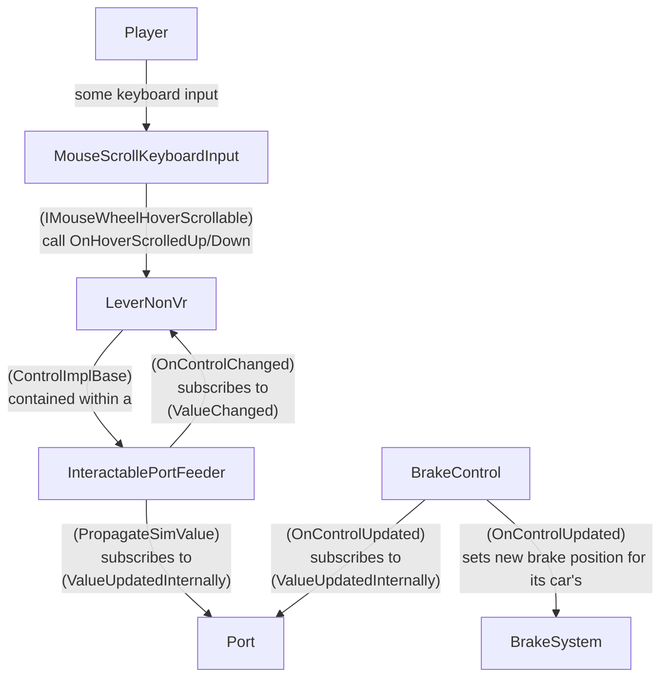

# findings

KeyBindingsConfiguration::ReadKeyBindingsFromFile(IniParser.Parser.IniDataParser)

- reads keybinds from the player's ini file
- at this step:
  - parses the ini
  - for each changeable keybind field:
  - (any KeyBinding-annotated field in KeyBindings that is not UnchangeableKeyBinding, and ends with `Keys`)

KeyBinding annotation can take a `KeyKode[]` containing default keybinds

need to intercept before any action taken to check for modifier key

`DV.KeyboardInput.MouseScrollKeyboardInput` is "most things"

`DV.KeyboardInput.MouseScrollKeyboardInput::Tick()` is a state machine, with 2 associated timers.
It is called every frame (?) and can be considered a big loop.

Brakes are under MouseScrollKeyboardInput.
all MouseScrollKeyboardInput does is translate keyboard inputs into scroll wheel inputs.

> So there's a whole chain of things beyond this. You've already traced most of the keyboard input system. After that, the mouse scroll input moves a cab control (e.g. a LeverNonVR) by calling OnHoverScrolledUp or OnHoverScrolledDown. The cab control is linked to a port via an InteractablePortFeeder. The Port is linked to an OverrideableBaseControl, in this case a BrakeControl, which in turn feeds the new control position into the car's BrakeSystem.
>
> ...InteractablePortFeeder attaches to the ValueChanged event of the control
>
> --Zeibach

